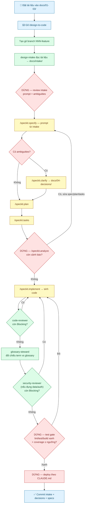

# spec-driven-jp — Template dự án tích hợp Spec Kit + đọc tài liệu thiết kế tiếng Nhật

Template cho các dự án greenfield dùng Claude Code, đặc biệt phù hợp với bối cảnh **BrSE làm việc với khách hàng Nhật**: có tài liệu basic design (基本設計), detail design (詳細設計), và Figma làm nguồn thiết kế đầu vào.

Tích hợp:
- **[GitHub Spec Kit](https://github.com/github/spec-kit)** làm khung xương spec-driven (constitution + specify → clarify → plan → tasks → analyze → implement)
- **4 subagent chuyên biệt** bù đắp phần Spec Kit không có: `design-intake` (đọc tài liệu Nhật + Figma qua MCP), `code-reviewer` (đối chiếu code với 4 nguồn sau khi implement), `security-reviewer` (pass bảo mật OWASP + secret + PII), và `glossary-steward` (gác nhất quán thuật ngữ Nhật-Việt-Anh)
- **Glossary Nhật-Việt-Anh** làm nguồn thuật ngữ chung
- **Permission gate** cấu hình sẵn theo nguyên tắc deny → ask → allow

## Có 2 cách dùng template này

### Cách 1: Dùng như GitHub template repo (khuyến nghị cho hầu hết trường hợp)

1. Fork/clone repo này lên GitHub tài khoản của bạn.
2. Vào Settings → chọn "Template repository" để biến nó thành template.
3. Với mỗi dự án mới, bấm "Use this template" → "Create a new repository".
4. `git clone` repo mới về máy, chạy `bash bootstrap.sh` để hoàn tất setup (chạy `specify init` để tạo `.specify/` và các slash command Spec Kit).
5. Chạy `/speckit.constitution` trong Claude Code — sau đó xem `docs/CONSTITUTION_APPEND.md` để bổ sung các article cho bối cảnh Nhật.

### Cách 2: Cài đặt như Claude Code plugin

Cách này phù hợp khi bạn muốn dùng bộ agent + command cho **nhiều dự án đã có sẵn**, không phải chỉ dự án mới.

```bash
# Trong Claude Code
/plugin marketplace add hoanghainh1188/spec-driven-jp
/plugin install spec-driven-jp@hoanghainh1188
```

Plugin sẽ cài 4 agent (`design-intake`, `code-reviewer`, `security-reviewer`, `glossary-steward`) và command `/design-to-code` vào user scope (`~/.claude/`). Xem chi tiết ở `plugin/README.md`.

**Lưu ý**: cách plugin không tự tạo cấu trúc `docs/` hay chạy `specify init` — bạn cần làm những bước đó thủ công nếu dự án chưa có sẵn. Cách 1 (template repo) tự động hóa cả 2.

## Cấu trúc dự án được sinh ra

```
<project>/
├── CLAUDE.md                       Quy ước dự án, agent đọc đầu tiên
├── bootstrap.sh                    Chạy specify init + bổ sung agent/command
├── .claude/
│   ├── settings.json              Permission deny/ask/allow đã cấu hình sẵn
│   ├── agents/
│   │   ├── design-intake.md       Đọc docs Nhật + Figma, sinh input cho /speckit.specify
│   │   ├── code-reviewer.md       Review code sau /speckit.implement
│   │   ├── security-reviewer.md   Pass bảo mật OWASP + secret + PII sau code-reviewer
│   │   └── glossary-steward.md    Gác nhất quán thuật ngữ Nhật-Việt-Anh (pipeline + standalone)
│   ├── hooks/
│   │   └── format.sh              Format-on-save hook (điền formatter theo stack)
│   └── commands/
│       └── design-to-code.md      Điều phối toàn bộ pipeline hybrid
├── docs/
│   ├── 00-glossary.md              Thuật ngữ 日本語 / VI / EN — nguồn duy nhất
│   ├── 01-basic-design/            基本設計 gốc từ khách hàng (không sửa tay)
│   ├── 02-detail-design/           詳細設計 gốc
│   ├── 03-ui/                      Link Figma + snapshot
│   ├── 04-decisions/               Câu trả lời cho /speckit.clarify
│   ├── intake/                     Output của design-intake
│   └── CONSTITUTION_APPEND.md      Gợi ý các article cho bối cảnh Nhật
├── src/
├── tests/
└── plugin/                         Metadata để dùng như Claude Code plugin
    ├── plugin.json
    └── README.md
```

Sau khi chạy `bootstrap.sh`, thêm:
```
├── .specify/
│   ├── memory/constitution.md      Do /speckit.constitution sinh
│   ├── templates/                  Template Spec Kit
│   └── scripts/                    Helper script Spec Kit
├── .claude/commands/speckit.*.md   7 slash command của Spec Kit
└── specs/                          Do Spec Kit sinh mỗi feature 1 thư mục
```

## Feature mẫu để tham khảo (xoá được)

Template kèm 1 feature mẫu tí hon — **予約承認 (duyệt đặt chỗ)** — để bạn thấy chuỗi traceability
thật trông thế nào trước khi tự chạy (dùng đường dẫn dạng code để xoá xong không để lại link chết):
- `docs/intake/000-example-reservation.md` — output mẫu của `design-intake`
- `docs/04-decisions/2026-01-01-approval-vs-confirm.md` — quyết định clarify mẫu
- `specs/000-example-reservation/spec.md` — spec mẫu (bình thường do Spec Kit sinh)

**Xoá trước khi làm dự án thật:**
```bash
rm -rf specs/000-example-reservation \
       docs/intake/000-example-reservation.md \
       docs/04-decisions/2026-01-01-approval-vs-confirm.md
```

## Workflow cho 1 feature

### Bước bạn thao tác
1. **Tạo GitHub issue** cho feature (số issue = ID feature), rồi tạo branch `NNN-<slug>` với
   `NNN` = số issue zero-pad ≥ 3 chữ số (VD issue #42 → `042-user-reservation`).
2. **Đặt tài liệu nguồn** (không sửa nội dung gốc):
   - `docs/01-basic-design/<feature>/` — 基本設計
   - `docs/02-detail-design/<feature>/` — 詳細設計
   - `docs/03-ui/<feature>/figma-links.md` — link Figma + snapshot
3. **Gõ `/design-to-code`** trong Claude Code, cung cấp đường dẫn tài liệu + link Figma khi được hỏi.
4. Ở mỗi bước **[HANDOFF]**, copy lệnh `/speckit.*` mà Claude in ra, tự dán chạy, rồi báo lại.
5. Duyệt ở mỗi **[DỪNG]** (review intake, analyze, test gate, deploy).

> **Nhiều người cùng làm 1 dự án?** Xem [`docs/TEAM-WORKFLOW.md`](docs/TEAM-WORKFLOW.md) — quy ước
> đánh số theo issue, branch/PR model, gác cổng glossary + constitution, và cách tránh conflict/lệch ngữ cảnh.

### Sơ đồ workflow



**Chú thích màu:**
🟦 Bạn thao tác · 🟩 `[TỰ CHẠY]` Claude tự làm (git + subagent) · 🟨 `[HANDOFF]` bạn tự dán lệnh `/speckit.*` · 🟥 `[DỪNG]` checkpoint chờ duyệt

### `/design-to-code` là runbook điều phối
Nó **không tự chạy được** các slash command `/speckit.*` (Claude Code không cho command gọi
command). Vì vậy có 2 loại bước:

| Loại | Ai làm | Gồm |
|------|--------|-----|
| **[TỰ CHẠY]** | Claude tự làm | tạo git branch, gọi subagent `design-intake`, `code-reviewer`, `glossary-steward`, `security-reviewer` |
| **[HANDOFF]** | **Bạn tự dán lệnh** | Claude in `/speckit.x …`, bạn chạy rồi báo xong |

Trình tự đầy đủ:

1. `[TỰ CHẠY]` tạo branch `NNN-<feature-slug>` (Spec Kit dùng tên branch để phát hiện feature)
2. `[TỰ CHẠY]` `design-intake` đọc tài liệu → sinh `docs/intake/<feature>.md`
3. **[DỪNG]** bạn review file intake (prompt + ambiguities)
4. `[HANDOFF]` `/speckit.specify <prompt từ intake>`
5. `[HANDOFF]` `/speckit.clarify` (nếu có mâu thuẫn) → câu trả lời ghi vào `docs/04-decisions/`
6. `[HANDOFF]` `/speckit.plan`
7. `[HANDOFF]` `/speckit.tasks`
8. **[DỪNG]** `/speckit.analyze` → sửa spec/plan/tasks nếu có cảnh báo trước khi implement
9. `[HANDOFF]` `/speckit.implement` → sinh code thật
10. `[TỰ CHẠY]` `code-reviewer` đối chiếu code với constitution + spec + plan + tasks → xử lý mọi **Blocking**
11. `[TỰ CHẠY]` `glossary-steward` đối chiếu term code/spec vs `docs/00-glossary.md` → sửa term lệch (term mới đề xuất PR glossary riêng)
12. `[TỰ CHẠY]` `security-reviewer` soi OWASP + secret + PII (chỉ khi feature đụng data/auth/API; nếu không thì tự SKIP) → xử lý mọi **Blocking**
13. **[DỪNG] Test gate** — format tự chạy qua hook `.claude/hooks/format.sh`; verify `npm run lint/test/build` phải xanh **và coverage đạt ngưỡng constitution** (Article W — mặc định ≥ 80% business logic)
14. **[DỪNG] Deploy** — theo phương thức khai trong mục `## Deploy` của `CLAUDE.md`

Cuối cùng, commit `docs/intake/`, `docs/04-decisions/`, `specs/<feature>/` làm bằng chứng traceability.

## Làm việc nhóm (nhiều người / 1 dự án)

Để tránh **git conflict** và **lệch ngữ cảnh** khi nhiều người cùng làm:

- **Feature ID = số issue GitHub** → branch `NNN-<slug>` (zero-pad ≥ 3 chữ số, VD `042-user-reservation`).
  Số issue duy nhất toàn cục → không trùng khi chạy song song.
- **1 người sở hữu 1 feature** end-to-end; branch ngắn hạn; PR `Closes #<issue>`; merge khi CI xanh + review pass.
- **Glossary + constitution** là file dùng chung → chỉ sửa qua **PR riêng được steward (code-owner) duyệt**.
- **Rebase `main` thường xuyên**; khi constitution/glossary đổi → chạy lại `/speckit.analyze` để bắt drift.

**2 việc setup thủ công (bắt buộc để cơ chế có hiệu lực):**
1. Sửa `.github/CODEOWNERS`: thay `@your-lead-handle` bằng GitHub handle thật của steward.
2. Bật **branch protection** cho `main`: *Require PR review* + *Require review from Code Owners*
   + *Require status checks* (`template-smoke-test`) + *Require branches up to date*.

📖 Chi tiết đầy đủ (vòng đời feature, bảng điểm nóng conflict, xử lý cập nhật design giữa chừng):
[`docs/TEAM-WORKFLOW.md`](docs/TEAM-WORKFLOW.md).

## Yêu cầu môi trường

- Claude Code (bản mới nhất, hỗ trợ subagent + command + settings.json)
- `uv` hoặc `pipx` để cài Spec Kit CLI (`uvx --from git+https://github.com/github/spec-kit.git specify init ...`)
- `git`
- **Figma MCP server** — để `design-intake` đọc Figma tự động, server PHẢI được đăng ký đúng tên
  `figma` (agent grant `mcp__figma__*`). Kiểm tra bằng `claude mcp list`; nếu server của bạn tên khác
  (VD `claude_ai_Figma`), đổi tên server hoặc sửa dòng `tools:` trong `.claude/agents/design-intake.md`.
  Nếu không có Figma MCP, `design-intake` vẫn chạy — nó đọc link/snapshot trong `docs/03-ui/`.
- **Skill đọc tài liệu** (`docx`, `xlsx`, `pdf`) — cần để `design-intake` trích nội dung file Office/PDF
  nhị phân (tool `Read` thuần không parse được). Nếu skill chưa cài, chuẩn bị sẵn bản export
  text/markdown của tài liệu đặt cạnh file gốc.

## Giấy phép

MIT — dùng thoải mái, sửa thoải mái. Nếu bạn cải tiến template, PR về là rất được hoan nghênh.
